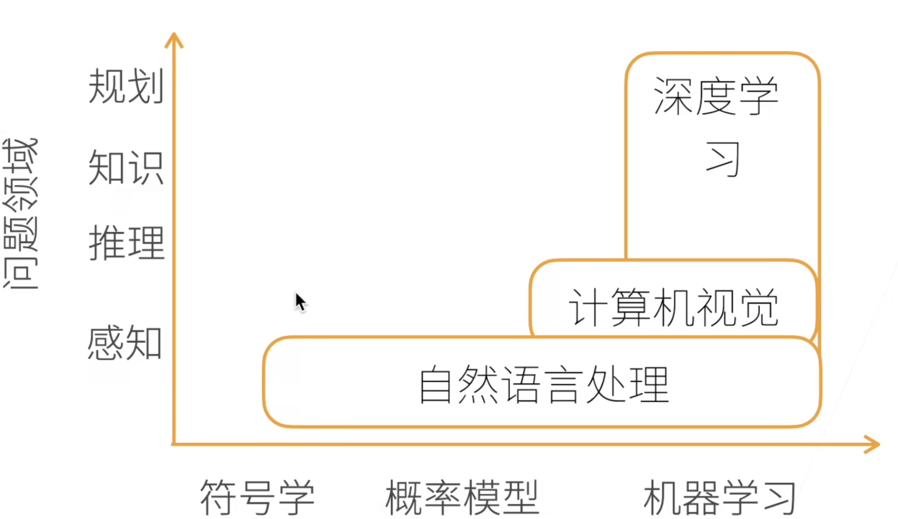
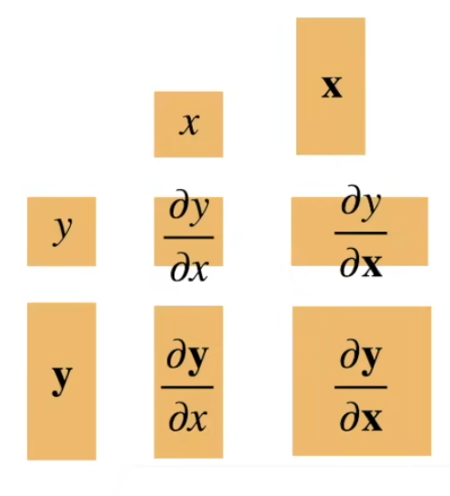
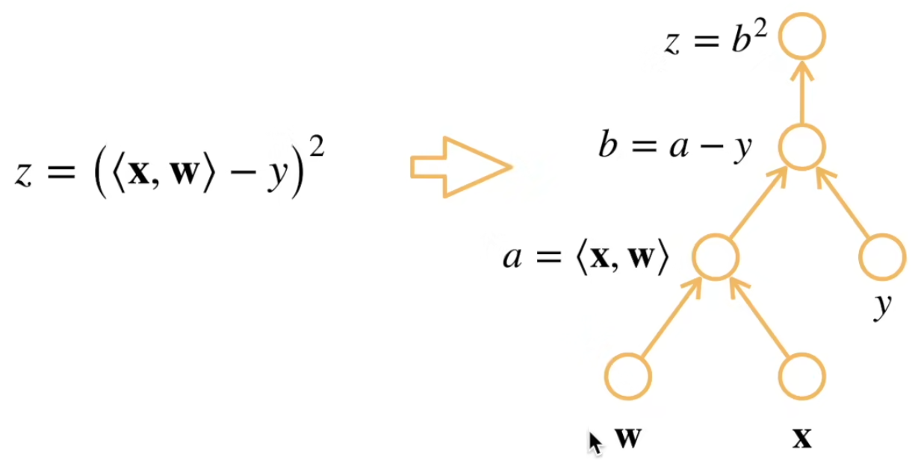

# 动手学深度学习

### 课程安排

#### 目标

* DL经典和最新模型
    * LeNet, ResNet, LSTM, BERT,...
* 机器学习基础
    * 损失函数、目标函数、过拟合、优化
* 实践
    * Pytorch
    * 真实数据上体验算法效果

#### 内容

* DL基础--线性神经网络，多层感知机MLP
* CNN--LeNet, AlxNet, VGG, Inception, ResNet
* RNN--RNN, GRU, LSTM, seq2seq
* Attention Mechanism--Attention, Transformer
* Optimization Algorithms--SGD, Momentum, Adam
* High-Efficiency Calculating--并行、Multi-GPU, 分布式
* CV--目标检测，语意分割
* NLP--Word Embedding, BERT

#### 学到

* DL相关技术
* 如何实现和调参， Tuning & Fine Tuning
* 背后的原因（直觉 & 数字）

### Intro to DL

#### AI map



* 图片分类
* 物体检测 & 分割
* 样式迁移
* 人脸合成
* 文生图
* 文字生成
* 自动驾驶

### 数据操作

#### N维数组 ndarray

* ML和NN的主要数据结构
* 创建数组
    * shape
    * dtype
    * value: may be random
* 元素访问
    * 确切索引
    * 数组切片
        * 左取右不取
        * 缺省是到端
        * 第三个参数是步长

```python
import torch

x = torch.arange(12)	# 直接输出0~11的一维tensor

x.shape
x.numel() 	# 元素的种数，是一个标量

y = x.reshape((3, 4)) # 变形为一个3*4的矩阵

torch.zeros((2, 3, 4))
torch.ones((2, 3, 4))

torch.tensor([[2, 1, 4, 3], [1, 2, 3, 4]])

# 可进行标准的算术运算符，都是按照对应元素进行的
# +, -, *, /, **

torch.exp(x)

x = torch.arange(12, dtype=torch.float32).reshape((3, 4))
y = torch.ones((3, 4))
torch.cat((X, Y), dim=0) # 按照第一维进行堆叠
# ([	[0, 1, 2, 3],
#		[4, 5, 6, 7],
#    	[8, 9, 10, 11],
#       [1, 1, 1, 1],
#       ...				])
torch.cat((X, Y), dim=1) # 按照第二列进行堆叠
# ([	[0, 1, 2, 3， 1, 1, 1, 1],
#		[4, 5, 6, 7， 1, 1, 1, 1],
#    	[8, 9, 10, 11， 1, 1, 1, 1]	])

x == y # 通过逻辑运算符得布尔矩阵

X.sum() # 直接对所有元素进行求和，返回一个tensor(66.)

# broadcasting mechanism
a = torch.arange(3).reshape((3, 1))
b = torch.arange(2).reshape((1, 2))
a + b
# 在最低纬度，a的一个元素直接进行复制，[[0], [1], [2]]变成[[0, 0], [1, 1], [2, 2]]
# 这之后最低纬度匹配了，再向上进行广播，b一行变三行得到[[0, 1], [0, 1], [0, 1]]
# 最后再相加[[0, 1], [1, 2], [2, 3]]

# 运行一些操作可能会导致为新结果分配内存
before = id(Y)
Y = Y + X
id(Y) == before # False，这个时候是将Y这个变量名指向了一个新的地址，新的地址存了上一句的运算结果

# 原地操作
Z = torch.zeros_like(Y)
Z[:] = X + Y

# 所以说，如果X没有重复使用，直接：
X[:] += Y  # 这样减少内存开销

# 转化为Numpy张量
A = X.numpy()
B = torch.tensor(A)
```

#### 数据预处理

创建一个人工数据集，并存储在csv文件

```python
import os

os.makedirs(os.path.join('..', 'data'), exist_ok=True)
data_file = os.path.join('..', 'data', 'house_tiny.csv')

with open(data_file, 'w') as f:
    f.write('NumRooms, Alley,Price\n') # 这个是列名
    f.write('NA,Pave,127500\n) # 这样每一行表示一个数据样本
```

从csv文件中加载源数据

```python
import pandas as pd
data = pd.reada_csv(data_file)
```

##### 处理缺失数据 -- 插值/删除

```python
data.head() # 默认显示前5行

data.iloc[:, 0:2] # 这个是显示所有行，前两列

inputs = data.iloc[:, 0:2]
inputs.fillna(inputs.mean(), inplace=True) # 使用均值代替缺失值

# 将离散值进行独热编码
inputs = pd.get_dummies(inputs, dummy_na=True) # dummy_na=True意思是将NaN也作为一个类
```

### 线性代数

* 标量

```python
x = torch.tensor([3.])
y = torch.tensor([2.]) # 这就是一个标量


```

* 向量

```python
# 将向量视为标量组成的列表(其实就是拉)
x = torch.tensor([1, 2, 3, 4.])

# 通过张量的索引访问任意元素
x[3] # 返回的是4.0

# len(x) = 4
# x.shape: torch.Size([4])

# reshape是创建了一个新的视图，但是修改reshape之后的内容会更改原来的数据

```

* 矩阵

  * 矩阵乘法是对空间做线性的变形使用`torch.mm`或者`@`
  * 矩阵按照元素乘法“哈达玛积Hadamard product”
  * 范数
  * 注意使用`B = A.clone()`防止对原tensor进行修改
  * 对于axis，直接理解为对应维度直接拍扁

* 矩阵计算——主要是如何求导数——gradient

  * 标量导数
  * 亚导数——将导数拓展到不可微的导数

* 将导数拓展到向量——Gradient梯度

  * 首先，一个标量对列向量的偏导得到的是一个行向量
    $$
    x = 
    \begin{bmatrix}
    x_1\\
    x_2\\
    \vdots\\
    x_n
    \end{bmatrix}\\
    \frac{\partial y}{\partial x} = 
    \begin{bmatrix}
    \frac{\partial y}{\partial x_1}, \frac{\partial y}{\partial x_2}, \cdots, \frac{\partial y}{\partial x_n}
    \end{bmatrix}
    $$

  * 

  * 自动求导——区别于符号求导&数值求导

    * 计算图——类似于链式过程
      * 将代码分解为操作子
      * 将计算表示成一个无环图
      * 
    * 自动求导的两种模式
      * 链式法则
      * 正向积累
      * 反向积累/反向传递

```python
import torch

x = torch.arange(4.)
print(x)

x.requires_grad_(True)
print(x.grad)

y = 2 * torch.dot(x, x)
print(y)

y.backward()
print(x.grad)

x.grad == 4 * x

# tensor([0., 1., 2., 3.])
# None
# tensor(28., grad_fn=<MulBackward0>)
# tensor([ 0.,  4.,  8., 12.])
# tensor([True, True, True, True])

```

### 线性回归&基础优化算法

 #### linear regression

线性模型可以看作是单层的神经网络

* 衡量预估质量
* 训练数据
* 参数学习——训练损失、最小化损失来学习参数


* 线性回归是对n维输入的加权，外加偏差
* 使用平方损失来衡量预测值与真实值的差异
* 线性回归有显示解
* 线性回归可以看作是单层神经网络

#### basic optimization algorithm

##### Gradient Descent

$$
w_t = w_{t - 1} - \eta \frac{\partial l}{\partial w_{t - 1}}
$$

* 沿梯度方向将增加损失函数值

* 学习率：步长的超参数

##### 小批量随机梯度下降

* 在整个训练级上算梯度太贵
  * 一个深度神经网络模型可能需要数分钟至数小时
* 可以随机采样b个样本来近似损失
  * b是批量batch大小，另一个重要的超参数


