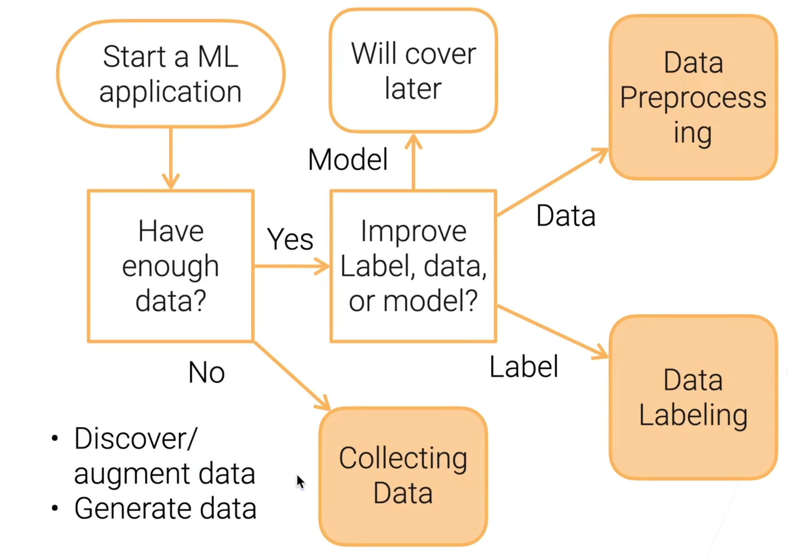
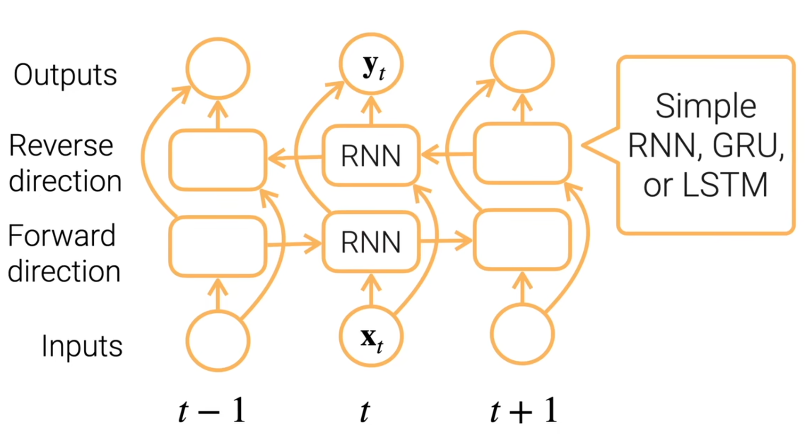
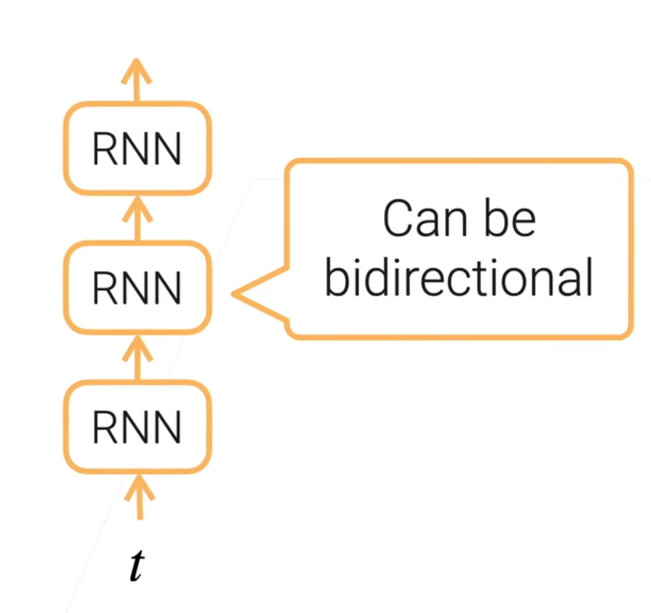
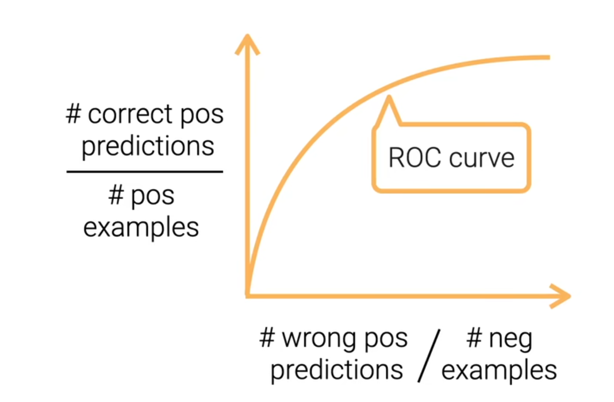
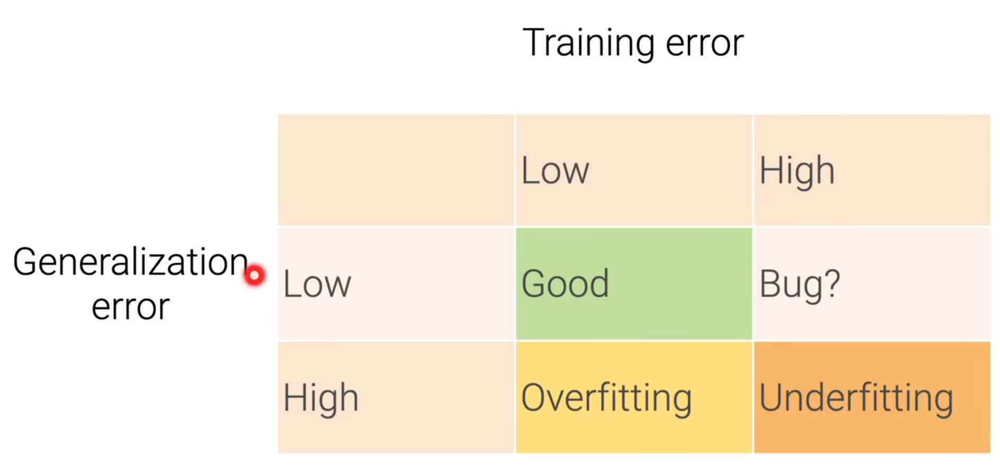
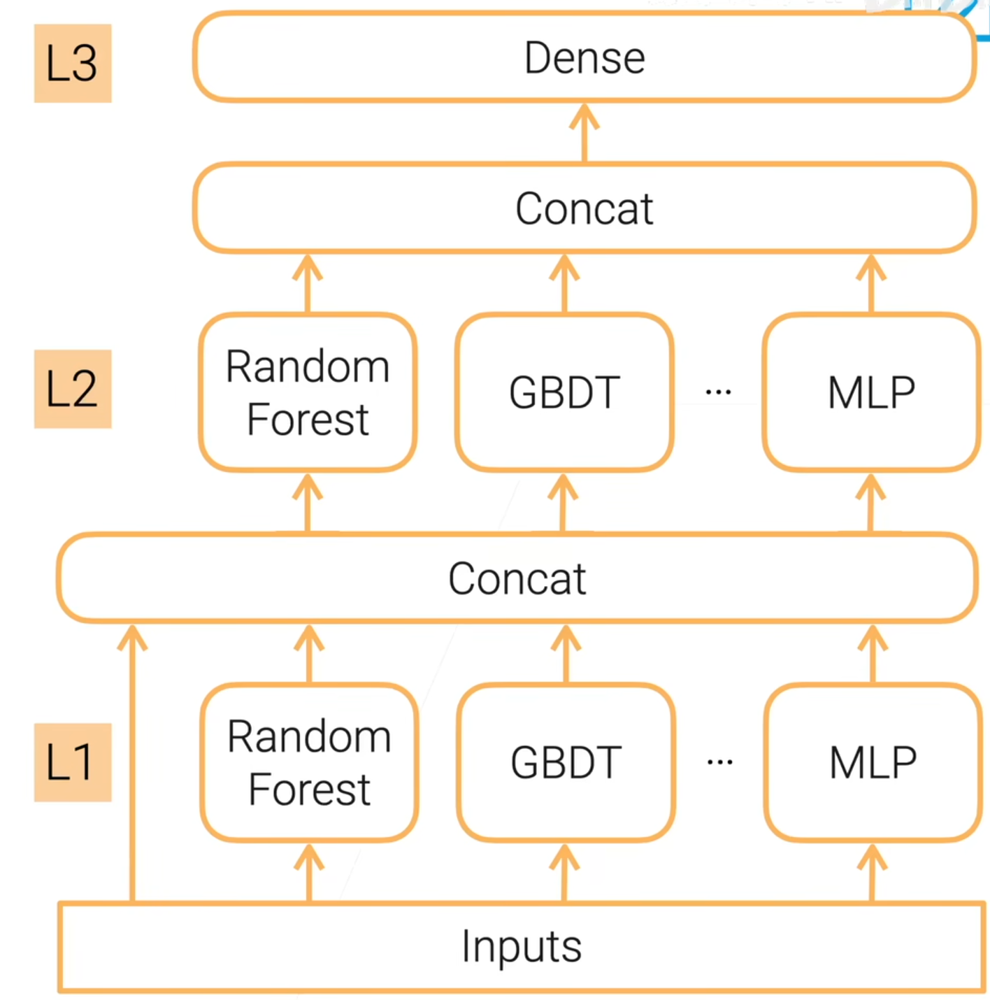
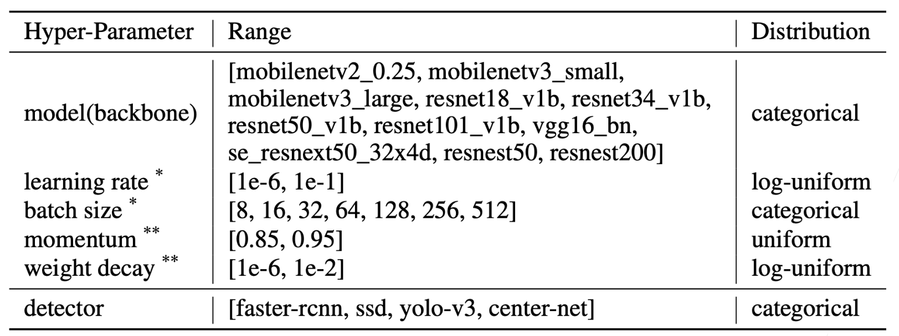
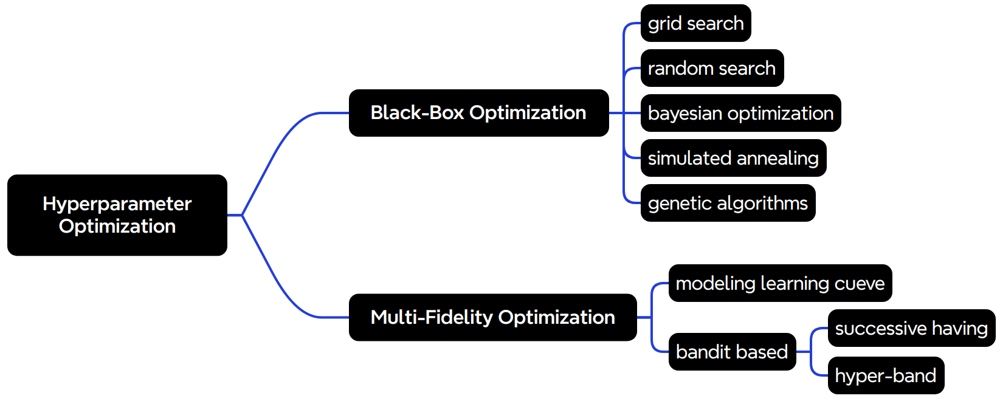
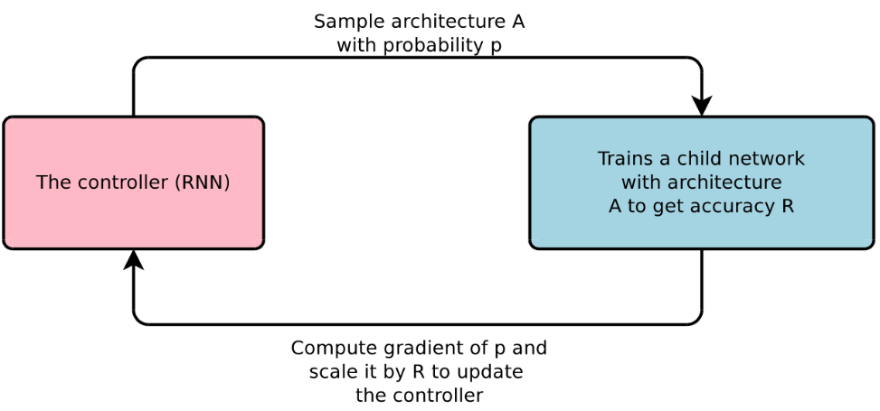

# 实用机器学习

## Introduction

### ML Workflow

`Problem formulation` --> `Collect & Process Data(Mointor Here)` --> `Train & Tune` --> `Deploy Models(to Monitor)`

### Course Tpoics

* Data
    * Collect/Process Data
    * Covariate/Concepts/Label Shifts
    * Data Beyond IID
* Train
    * Model Validation/Combinations/Tunig
    * Transfer Learning(迁移学习)
    * Multi-modality(多模态)
* Deploy
    * Model Deployment
    * Distillation
* Monitor
    * Fairness
    * Explainability

## CH1

### 数据获取--Data Acquisition

#### Flow Chart

##### three questions:

* Have enough data--
* are there external datasets -- discover or integrate data
* have data generation methods -- generate data

#### discover what data is avaliable

* identifing existing datasets

    * MNIST， ImageMet, AudioSet, Kinetics, KITTI, Amazon Review, SQuAD, LibriSpeech, etc. 

* find benchmark datasets to evaluate a new idea

    * 在ML中，“benchmark”通常指用于评估模型或算法性能的标准数据集和方法
    * e.g. a diverse set of small to medium datasets for a new hyper-parameter tuning algorithm
    * e.g. large scale datasets for a very big deep neural network 

* collect new data

    * e.g. driving videos covering different drving scenes 

    

* Where to find datasets

    * Paperswithcodes Datasets
    * Kaggle Datasets
    * Google Datasets search
    * various toolkits datasets: tensorflow, huggingface
    * various conference/company ML competitions
    * Open Data on AWS

* after collecting: **Data Integration**

    * Combine data from multiple sources into a conerent datasets
    * product data is often stored in multiple tables
    * Join tables by keys, which are often entity IDs
    * Key issues: Identify IDs, missing rows, redundant columns, value conflicts

* Generate Synthetic Data

    * Use GANs
    * Data Augmentations数据增强
        * Image augmentation
        * Back Translation（翻译成中文再翻译回英文，可能产生不同句式）

### 网页数据抓取--Web Scraping

#### Scraping Tools:

* `curl` often diesn't work

    * wensite owners use various ways to stop bots

* Use headless browser: a web browser wothout a GUI

    ```python
    from selenium import webdriver
    
    chrome_options = webdriver.ChromeOptions()
    chrome_options.headless = True
    chrome = webdriver.Chrome(
    	chrome_options=chrome_options	
    )
    
    page = chrome.get(url)
    ```

* You need a lot of new IPs, easy to get through public clouds

    * In a IPv4 IPs, AWS owns 1.75%, Azure 0.55%, GCP 0.25%


### 数据标注Data Labeling

(Self-training, Crowdsourcing, Data Programming)

#### Semi-Supervised Learining(SSl)

* Focus on the scenario where there is a small amount of labeled data, along with large amount of unlabeled data
* make assumptions on data distribution to use unlabeled data
    * Continuity assumption: examples with similar features are more likely to have the same label
    * Cluster assumption: data have inherent cluster structure, examples in the same cluster tend to have the same label
    * Manifold assumption: the data lie in the manifold of much lower dimension than the input space

##### Self-training

train model from labeled data, then predict the unlabeled data, finally merge from the pseudo-labeled data(only keep highly confident predictions)

#### Active Learning

* Focus on same scenario as SSL but with human intervention
    * select the most "interesting" unlabeled data to labelers
* Uncertainty sampling chooses an example whose prediction is most uncertain
    * the highest class prediction score is close the random (1 / n)(这部分让人工标注)
* similarr to self-training, we can use expensive models
    * query-by-committee trains multiple models and performs major voting

#### Active Learning + Self-Training

1. Train models from the labeled data
2. then predict the unlabeled data and find the least confident data to be labedel by the labelers
3. at the sane time, merge the labeled data from the pseudo-labeled data(the most confident unlabeled data)

#### Weak Supervision

* Semi-automatically generate labels
    * less accurate than manual ones, but good enough for training
* Data programming: hearistic programs to assign labels
    * keyword search, pattern matching, third-party models
    * e.g. rules to check if YouTube comments are spam or ham


## CH2 Preprocessing

### 探索性数据分析 Exploratory Data Analysis

```python
from IPython import display
display.set_matplotlib_formats('svg') # 设置为svg文件，话起来好看哇
```

* 读取数据

    ```python
    data = pd.read_csv('house')
    ```

* 基础信息

    ```python
    data.shape() 	# 直接看形状
    data.head()		# 前几列，默认参数为5
    data.describe()	# 统计信息
    ```

* **Drop columns that at least 30% values are null to simplify our EDA**

    ```python
    null_sum =  data.isnull().sum()
    data.columns[num_sum < len(data) * 0.3] 	# 这一句只是展示
    
    data.drop(columns=data.columns[null_sum > len(data) * 0.3], inplace=True)	# 使用inplace=True执行原地操作，就不会占用更多的新内存
    ```

* 数据类型处理

    ```python
    data.dtypes		# 查询各列的数据类型，这里使用的是array数组视图
    ```

    类型转换例子

    ```python
    currency = ['Sold Price', 'Listed Price', 'Tax assessed value', 'Annual tax amount']
    for c in currency:
        data[c] = data[c].replace(r'[$,-]', '', regex=True).replace(r'^\s*', np.nan, reegex=True).astype(float)
    ```

    ```python
    areas = ['Total interior livable area', 'Lot size']
    for c in areas:
        acres = data[c].str.contains('Acres') == True
        col = data[c].replace(r'\b sqft \b|\b Acres\b|\b', '' ,regex=True).astype(float)
        data[c] = col
    ```

* 异常值处理

    ```python
    abnormal = (data[areas[1]] < 10) | (data[areas[1]] > 1e4)
    data = data[~abnormal]
    sum(abnormal)
    ```

* 数据分布展示

    ```python
    ax = sns.histplot(np.log10(data['Sold Price']))
    ax.set_xlim([3, 8])
    ax.set_xtics(range(3, 9))
    ax.set_xticklabels(['.0e'%a for a in 10**ax.get_xticks()]);
    ```

* 查看各value

    ```python
    data['type'].value_counts()[0: 20]
    ```

    看类别对价格分布的影响

    ```python
    types = data.isin(['SingleFamily', 'Condo', 'MultiFamily', 'Townhouse'])
    sns.displot(
    	pd.DataFrame({
            'Sold Price': np,log10(data[types]['Sold Price']),
            'Type': data[types]['Type']
                     }),
        x='Sold Price',
        hue='Type',
        kind='kde'
    )
    ```

    使用箱图查看各分位点位置及异常值(可能已经处理过了)

    ```python
    data
    ax = sns.boxplot(x=, y=, )
    ax.set_ylim([])
    ```

    还可以使用热力矩阵图直观的查看各列之间的关系

    ```python
    _, ax = plt.subplots(figsize=(6, 6))
    columns = ['Sold Price', 'Listed Price', ...]
    sns.heatmap(data[columns].corr(), annot=True, cmap='RdYlGn', ax=ax)
    ```


#### Summary

the basic technologies for EDA:

* Understanding column data types, values, and distributions
* Understanding the interactions between columns

### 数据清理Data Cleaning

if very noisy, we need data cleaning.

#### Data Errors

* Data often have errors - the mismatch with ground truth
    * e.g. missing, erroeous or extreme values

* Good ML models are resilient to errors
    * the training often converges, but the accuracy is degraded
* Deploying these models online may impact the quality of the new collected data

##### Types of Data Errors

* **Outliers**: data values that deviate from the distribution of values in the column
    * visualize with **boxplot**...
* **Rule violations**: violate integrity constraints such as "Not Null" and "Must be Unique"
    * Rule-based Detection
* **Pattern violations**: violate syntactic and demantic constraints such as alignment, formatting, misspelling

#### Rule-based Detection

* Functional dependencies: x -> y means a value x determines a unique value y
    * e.g. zip code -> state, EIN -> company name
* Denial constrains: a more flexible first-order logic formalism
    * phone number is not empty if vender has an EIN
    * if two captures of the same animal indicated by the same tag number, then the first one must be marked as original

#### Pattern-based Detection

* Syntactic patterns, e.g.
    * eng -> English
    * map a column to the most prominent data type and identify values that do not fit
* Sematic patterns, e.g.
    * add rules through knowledge graph
        * values in column "Country" need to have capitals, so a value "Stanford" is invalid.

#### Summary

* Types of data errors: outliers, rule violations, pattern violations
* Detect errors and fit them by: model distribution, integrity contrains(functional dependencies, denial contrains) syntactic/dematic patterns
* Multiple tools to help data cleaning
    * Graphic Interface for interactive cleaning
    * Automatically detect and fix 

### 数据变换Data Transformation

* Data are transformed into forms appropriate for ML algorithms
    * It could include most data preprocessing steps (e.g. data cleaning, feature engineering)
* We focus on methods in a particular step for various data types

#### Normalization for Real Value Columns

* min-max normalization: linearily map to a new min a and max b
    $$
    x_i' = \frac{x_i - min_x}{max_x - min_x}(b - a) + a
    $$

* Z-score normalization: 0mean, 1 standard deviation
    $$
    x_i' = \frac{x_i - mean(x)}{std(x)}
    $$

* Decinal Scaling
    $$
    x_i' = \frac{x_i}{10^j}~smallest~j~s.t.~max|v'| < 1
    $$

* log scaling
    $$
    x_i' = log(x_i)
    $$

#### Image Transformations

* Our previous web scaling will scrape 15TB images for a year
    * 5 millions houses sold in US per year, ~20 images/house, ~153KB per image, ~1041 * 732 resolution
* Downloading and cropping
    * Reduce image sizes to save storage and for fast loading
    * ML is goot at low-resolution images
    * be aware of image quality
* Image whitening
    * Make input less redundant
    * model coverges faster

#### Video Transformations

* Average video length
    * Movies ~ 2h, YouTube videos ~ 11min, Tiktok short videos ~ 15sec
* Preprocessing to balance storage, quality & loading speed
* We often use short video clips(< 10sec)
    * Each clip usually contains a single event(e.g. a human action)
* Decode a playable video, sample a sequence of frames
    * Best for loading, but 10x more space
    * Computation may be cheaper than storage(e.g. use GPU to decode)
    * Can apply other image tranformations to the frames

#### Text Transformations

* Stemming and lemmatization: a word -> a commmon base form
    * e.g. am, is, are -> be, car, cars, car's, cars' -> car
* Tokenization: text -> a list of tokens(smallest unit to ML algorithms)
    * text.split(' ')
    * text.split('')
    * by subwords
        * Unigram, WordPiece,...
        * e.g. "a new gpu!" -> "a", "new", "gp", "##u", "!"

#### Summary

* Data transformation transfers data into formats prefered by ML algorithms, and balance data size, quality, and loading speed
* Tabular(表格式的，比如dataframe): normalize real value features
* Images: cropping, downsampling, whitening
* Videos: clipping, sampling frames
* Text: stemming, lemmatization, tokenization

### 特征工程Feature Engineering

* ML algorithms prefer well defined fixed length input/output
* Feature engineering(FE) is the key to ML models before deep learning(DL)
    * In a computer vision task, people try various FE methods and then train a SVM model
* DL train deep neural networks to extract features
    * Features are relevant to the task

#### Tabular Data Features

* int/float: directly use or bin(区间) to **n** unique int values
* Categorical data: ont-hot encoding
    * Map rare categories into "Unknown"
* Date-time: a feature list such as
    * [year, month, day, day_of_year, week_of_year, day_of_week]
* Feature Combination: Cartesian product of two feature group
    * [cat, dog] x [male, female]

#### Text Features

* Represent text as token features
    * Bag of words(BoW) model
        * limitations: needs careful vocabulary design, missing context
    * Word Embeddings(e.g. Word2vec):
        * Vectorizing eords such that similar words are placed close together
        * Trained by prediction target word from context words
* Pre-trained language models(e.g. BERT, GPT-3)
    * Giant transformer models
    * Trained with large amount of unannotated data
    * Fine-tuning for downstream tasks

#### Image/Video Features

* Traditionally extract images by hand-craft features such as SIFT
* Now commonly use pre-trained deep neural networks
    * ResNet: trained with ImageNet(image classification)
    * I3D: trsin with Kinetics(actino classification)

#### Summary

* Features matter
* Features are hand-crafted or learned by deep neural networks
    * the latter is prefered if available(images/videos/audio/text)  --  (will cover more later in "Transfer Learning迁移学习")

### 数据科学家的日常/Data Part Summary



#### Challenges

* The trade-off between label quality vs data volumn
* Data quality
    * diversity: all releevent aspects are represeted
    * unbiased: no biased on a particular side
    * fairness: non discriminating treatment of data and people
* Large-scale data management: storage, process, versioning security

## CH3

### 机器学习介绍

#### Types of ML Algorithms

* Supervised: train on labeled data to predict labels
    * Self-supervised: labels are generated from data(word2vec, BERT)
* Semi-supervised: train on both labeled & unlabeled data, learn models to predict labels or infer labels for unlabeled data
    * self-training
* Unsupervised: train on unlabeled data
    * clustering, density estimationn(GAN)
* Reinforcement: use observations from the interaction in environment to take actions to max

#### Components in supervised trining

* Model: output predicts from inputs
    * e.g. listing house -> sale price
* Loss: Measure difference between predicts and ground truth labels
    * e.g. $(predict_~price - sale_~price)^2$
* Observe: any function to optimize during training
    * e.g. minimize the sum of losses over examples
* Optimization: learin model parameters by solving the objective function

#### Types of supervised models

* Decision trees: use trees to make decisions
* Linear mothods: decision is made from a linear combinations of inputs
* Kernel mechines: use kernel functions to compute feature similarities
* Neural Networks: use neural networks to learn feature representations

### 决策树 Decision Trees

#### Pros & Cons

* Pros
    * Explainable
    * can handle both numerical and categorical features
* Cons
    * very non-robust(ensemble to help)
    * complex trees cause overfitting(prune trees)
    * not easy to be parallelized in computing

#### Random Forest

* Train multiple decision trees to improve robustness
    * Each tree is trained independently
    * majority voting for classification, average for regression
* Where is the randomness from 
    * bagging(有放回的抽样): randomly sample training examples with replacement
    * randomly select a subset o ffeatures

#### Gradient Boosting Decision Trees

* Train multiple trees sequentially
* At step t = 1, ..., denote by $F_t(x)$ the sum of past trained trees
    * Train a new tree $f_t$ on residuals: $\{(x_i, y_i - F_t(x_t))\}_{i = 1, ...}$
    * $F_{t + 1}(x) = F_t(x) + f_t(x)$
* The residual equals to $- \partial L / \partial F$ if using mean squareerror as the loss, so it's called gradient boosting

#### Summary

* Decision Tree: an explainable model for calssification/regression
* Ensemble trees to reduce bias and variance
    * Random forest: trees trained in parallel with randomness
    * Gradient boosting trees: train in sequantial on residuals
* Trees are widely used in industry
    * Simple, easy-to-tune, often gives satisfied results

### 线性模型 Linear Methods

#### Linear Regression

* In general, given data $x = [x_1, x_2, ..., x_p]$, linear regression predicts $y = w_1x_1 + w_2x_2 + ... + w_px_p + b = <w, x> + b$

#### Objective function

* collect **n** training examples $x = [x_1, x_2, ..., x_n]^T \in \mathcal{R}^{n * p}$ with labels $y = [y_1, ..., y_n]^T \in \mathcal{R}^n$

* Objective: minimize the mean square error(MSE)
    $$
    \begin{align}
    w^*, b^* &= argmin_{w, b} \mathcal{l}(X, y, w, b)\\
     &= argmin_{w, b}\frac{1}{n} \Sigma_{i = 1}^n||y_i - <x_i, w> - b||^2
    \end{align}
    $$

* Exercise: write the closed form solution

#### Use Linear Regression for classification

* Regression: continuous output in $R$
* Multi-class calssification
    * vector outputs, i-th output reflects the confidence score as belongs to class i
    * learn a linear model for each class $o_i = <x, w_i> + b_i$
    * Label $y = [y_1, y_2, ..., y_m]$ where $y_i = 1$ if i = y othrewise 0
    * minimize MSE loss $\frac{1}{m} ||o - y||_2^2$
    * Predict label $argmax_i\{o_i\}_{i = 1}^m$

#### Softmax Regression

* Label $y = [y_1, y_2, ..., y_m]$ where $y_i = 1$ if i = y otherwise 0

* turns scores into probabilities (non-negative, sum to 1)
    $$
    \hat{y} =  softmax(0)~where~\hat{y}_i = \frac{exp(o_i)}{\Sigma_{k = 1}^m exp(o_k)}
    $$

    * still a linear model, decision made as $argmax_i \hat{y}_i = argmax_i o_i$

* Cross-entropy(交叉熵) loss between two distributions $\hat{y}$ and y
    $$
    H(y, \hat{y}) = \Sigma_i {-y_i log(\hat{y}_i)} = -log(\hat{y}_y)
    $$

    * when label class is i, assigns less penalty on $o_j$ as long as $o_j << o_i$

##### Cross-Entropy

用于评估模型输出的概率分布和真实概率分布的差异

多分类：$E = - \Sigma_{i = 1}^n y_i * log(p_i)$

其中，y表示样本的真实标记、p表示模型的预测概率。于是，多分类问题的交叉熵损失，只与真实类别对应的模型预测概率有关。所以，即便模型对其他类别的预测概率不准确，但只要对真实类别的预测概率较高，损失函数的值仍然较低。

### 随机梯度下降

#### Mini-batch Stochastic gradient descent(SGD)

* Train by mini-batch SGD (by various other ways as well)
    * w model param, b batch size, $\eta_t$ learning rate at time t
    * randomly initialize $w_1$
    * repeat $t = 1, 2, ...$ until converge
        * randomly samples $I_t \in \{1, ..., n\}$ with $|I_t| = b$
        * update $w_{t + 1} = w_t - \eta_t \nabla_{W_t} \mathcal{l} (X_{I_t}, y_{I_t}, w_t)$
* Pros: solve all objectives in this course except for trees
* Cons: sensitive to hyper-parameters b and $\eta_t$

#### Code

* Train a linear regression model with min-batch SGD
* Hyperparameters
    * batch_size
    * learning_rate
    * num_epochs

```python
# `features` shape is (n, p), `labels` shape is (p, 1)
def data_iter(batch_size, features, labels):
    num_examplesm = len(features)
    indices = list(range(num_exxamples))
    random.shuffle(indices) # read examples at random
    for i in range(0, num_examples, batch_size):
        batch_indices = torch.tensor(
        	indices[i: min(i + batch_size, num_examples)]
        )
        yield features[batch_indices], labels[batch_indices]
        
w = torch.normal(0, 0.01, size=(p, 1), requires_grad=True)
b = zeros(1, requires_grad=True)

for epoch in range(num_epochs):
    for X, y in data_iter(batch_size, features, labels):
        y_hat = X @ w + b
        loss = ((y_hat - y)**2 / 2).mean()
        loss.backword()
        for param in [w, b]:
            param -= learning_rate * param.grad 
            param.grad_zero_()
```

#### Summary

* Linear methods linearly combine inputs to obtain predictions
* Linear regression uses MSE as the loss function
* Softmax regression is for multiclass classification
    * turn predictions into probabilities and use cross-entropy as loss
* Mini-batch SGD can learn both methods (and later neural networks as well)

### 多层感知机

#### Handcrafted Features -> Learned Features

* NN usually requires more data and more computation
* NN architectures to model data structures
    * multilayer perceptron
    * CNN--Convolutional Neural Networks
    * RNN--Recurrent Neural Networks
    * Transformers

#### Linear Methods -> Multilayer Perceptron(MLP)

* A dense (fully connected, or linear) layer has parameters $W \in R^{m \times n}, b \in R^{m}$it computes output $y = Wx + b \R^m$

    * Linear regression: dense layer with 1 output

    * Softmax regression:

        dense layer with m outputs + softmax

#### MLP

* Activation is an elemental-wise non-linear function
    * $Sigmiod(x) = \frac{1}{1 + exp(-x)}$, $ReLU(x) = max(x, 0)$
    * It leads to non-linear models
* Stack multiple hidde layers
    * (dense + activation) to get deeper models
* Hyper-parameters
    * #hidden layers
    * #outputs for each hidden layer

#### Code

* MLP with 1 hidden layer
* Hyperparameter: num_hiddens

```python
def relu(X):
    return torch.max(X, 0)

W1 = nn.Parameter(torch.randn(num_inputs, num_hiddens) * 0.01)
b1 = nn.Parameter(torch.zeros(num_hiddens))
W1 = nn.Parameter(torch.randn(num_hiddens, num_outputs) * 0.01)
b1 = nn.Parameter(torch.zeros(num_outputs))

H = relu(X @ W1 + b1)
Y = H @ W2 + b2
```


#### Concepts

* Linear: 线性层
    * 将输入数据通过线性变换转换为输出
* Dense: 密集层
    * 基本上就是全连接层，接收来自前一层的所有输出，并将它们结合起来进行计算
* MLP: 多层感知器
    * 可以看作一种具有隐藏层的神经网络，其中每一层都由多个神经元组成。MLP通过将输入数据通过多个非线性变换进行处理，从而学习到更复杂的特征。（在处理复杂模式和抽象概念时特别有效）
* FC: 全连接层(fully connected)
    * 一种特殊的密集层，所有神经元都与前一层所有神经元相连。这种层通常出现在神经网络的最后一层，用于进行分类或回归等任务

### 卷积神经网络CNN

#### Dense layer -> Convolution layer

* Learn ImageNet (300 * 300 images with 1K classes) by a MLP with a single hidden layer with 10K outputs
    * It leads to 1 billion learnable parameters, too big
    * Fully Connected： an output is a weighted sum over all inputs
* Recognize objects in images
    * Translation invariance: similar output no matter where the object is
    * Locality: pixels are more related to near neighbors
* Build the prior knowledge into the model structure
    * Achieve same model capacity with less #params

#### Converlution layer

* Locality: an output is computed from k * k input windows
* Translation invariant: outputs use the same k * k weights(kernel)
* #model params of a conv layer does not depend on input/output sizes
* A kernel may learn to identify a pattern

#### Code

* Convolution with single input & output channels

    ```python
    # both input `X` and weight `K` are matrices
    h, w = K.shape
    Y = torch.zeros((X.shape[0] - h + 1), X.shape[1] - w + 1)
    for i in range(Y.shape[0]):
        for j in range(Y.shape[1]):
            Y[i, j] = (X[i: i + h, j: j + w] * K).sum() 
            # precisely it's called cross-correlation
    ```

#### Pooling Layer

池化层/汇聚层

* Convolution is sensitive to location

    * a pixel shift in the input results in a pixel shift in output

* A polling layer computes mean/max in k * k windows

    ```python
    # h, w: polling window height and weight
    # mode: max or avg
    Y = torch.zeros((X.shape[0] - h + 1), X.shape[1] - w + 1)
    for i in range(Y.shape[0]):
        for j in range(Y.shape[1]):
            if mode == 'max':
                Y[i, j] = X[i: i + h, j: j + w].max()
            elif mode == 'avg':
                Y[i, j] = X[i: i + h, j: j + w].mean()
    ```

#### Convolutional Neural Networks(CNN)

* Aneural network uses stack of convolution layers to extract features
    * Activication is applied after each convolution layer
    * Using polling to reduce location sensitivity
* Modern CNNs are deep neural network with various hyper-parameters and layer connections(AlexNet, VGG, Inceptions, ResNet, MobileNet)

### 循环神经网络(RNN)

Dense layer -> Recurrent networks

* Language model: predict the next word
    * hello -> world
    * hello world -> !
* Use MLP naively doesn't handle sequence info well

#### RNN & Gated RNN

* Simple RNN: $h_t = \phi(W_{hh}h_{t - 1} + W_{hx}x_t + b_h)$
* Gated RNN(LSTM, GRU): finer control of information flow
    * forget input: suppress $x_t$ when computing $h_t$
    * forget pastL suppress $h_{t - 1}$ when computing $h_t$

#### Code

* Implement Simple RNN

    ```python
    W_xh = nn.Parameter(torch.randn(num_inputs, num_hiddens) * 0.01)
    W_hh = nn.Parameter(torch.rand(num_hiddens, num_hiddens) * 0.01)
    b_h = nn.Parameter(torch.zeros(num_hiddens))
    
    H = torch.zeros(num_hiddens)
    outputs = []
    
    for X in inputs: # `inputs` shape: (num_steps, batch_size, num_inputs)
        H = torch.tanh(X @ W_xh + H @ W_hh + b_h)
        outputs.append(H)
    ```

#### Bi-RNN & Deep RNN

* Bidirectional RNN

    

    

* Deep RNN

    

#### Summary

* MLP: stack dense layers with non-linear activations
* CNN: stack convolution activation and pooling layers to efficiently extract spatial information
* RNN: stack recurrent layers to pass temporal informaation through hidden state

## CH4 Model Validation

### 模型评估Evalution Metrics

#### Model Metrics

* In supervised learning, we train models by minimizing the training loss
    * The loss value is a widely used metrics to measure model quality
* There are many other metrics
    * Model specific: e.g. accuracy for classification, mAP for object detection
    * Business specific: e.g. revenue, inference latency
* We select models by multiple metrics
    * Just like how you choose cars

#### Case Study: Displaying Ads

* Ads is one major revenue source for Internet companies

`Querypage` -> `Retrieve related ads` -> `Estimate click through rate(CTR)`(a binary classification problem) -> `DIsplay top ads ranked by CTR * price` 

#### Metrics for Classification

* Accuracy: $\frac{\#correct~predictions}{\#example}$

    ```python
    sum(y == y_hat) / y.size
    ```

* Precision: $\frac{\#correctly~predictedd~as~class~i}{\#predicted~as~class~i}$

    ```python
    sum((y_hat == 1) & (y == 1)) / sum(y_hat == 1)
    ```

* Recall: $\frac{\#correctly~predicted~as~class~i}{\#examples ~in~class~i}$

    ```python
    sum((y_hat == 1) & (y == 1)) / sum(y == 1)
    ```

* F1: Balance precision and recall(调和平均)

    * the harmonic mean of precision and recall $\frac{2pr}{p + r}$

#### AUC & ROC

* AUC, the area under ROC curve, measures the chance a model can distinguish classes

    * choose various $\theta$ predict as pos if $\hat{y} > \theta$ else neg

        

#### Business Metrics for Displaying Ads

* Optimize both revenue and customer experience
    * Latency: ads should be shown to users at the same time as others
    * ASN: average #ads shown in a page
    * CTR: user click through rate
    * ACP: average price advertiser pays per click
* revenue = #pageviews * ASN * CTR * ACP

#### Models -> Business Metrics

* The key model metric is AUC
* A new model with increased AUC may harm business metrics
    * it selects different ads to display, these ads may have
        * lower estimated CTR -> less ads displayed
        * lower real CTR because we only evaluated on past data
        * Lower prices
* The solution is to deploy models to evaluate on real trace data 

### 过拟合&欠拟合 Overfitting & Underfitting

#### case: Who will repay their loans

* A lender hires you to investigate who will repay their loans
    * You are given complete files on 100 applicants
    * 5 defaulted within 3 years
* A surprising Finding
    * all 5 people who defaulted wore blue shirts during interviews
    * your model leverages this strong signal as well

#### Training and Generalization Errors

* Training error: model error on the training data
* Generalization error: model error on new data
* Example: practice a future exam with past exams
    * doing well on past exams(training error) doesn't guarantee a good score on the future exam(generalization error)
    * Student A gets 0 error on past exams by rote(cram 死记硬背) learning
    * Student B understanding the reasons for given answers 

#### Underfitting & Overfitting



#### Model Complexity

* The ability to fit variety of functions
    * low complexity models struggles to fit training set
    * High complexity models can memorize the training set
* It's hard to compare between very different algorithms
    * e.g. trees vs meural network
* In an algorithm family, two factors matter:
    * The number of parameters
    * The values taken by each parameter

#### Data Complexity

* Multiple factor matters
    * #examples
    * #elements in each example
    * time/space structure
    * diversity
* Again, hard to compare amoung very different data
    * e.g. a char vs a pixel

#### Model Selection

* Pick a model with a proper complexity for your data
    * Minimize the generalization error
    * Also consider businesss metrics
* Start with pick up a model family, then select proper hyper-parameters
    * Trees: #trees, maximal depths
    * Neural networks: architecture, depth(#layers), width(#hidden weights), regularizations

#### Summary

* we care about generalization error
* Model complexity: the ability ti fit various functions
* data complexity: the richness of information
* model selection: match model and data complexities

### 模型验证 Model Validation

#### Estimate Generalization Error

* Approximated by the error on a test dataset, which can be only used once
    * your score on midterm exam
    * the house sale price I bided
    * Dataset used in private leaderboard in Kaggle
* Validation dataset: can be used by multiple times
    * often a part of the training dataset
    * when we use "test", in most time we mean "validation"

#### Hold Out Validation

* Split your data into "train" and "valid" sets (often calls "test")
    * train your model on the train set, use the error on the valid set to approximate the generalization error
* Often randomly select n% examples as the valid set
    * typical choices n = 50, 40, 30, 20, 10s

#### Split non I.I.D data

* random splitting may not work
* sequential data: e.g. house sales, stock prices
    * Valid set should after train set
* Examples belongs to groups: e.g. photos of the same person
    * split among groups instead of examples
* In-balanced data
    * Sample more from minor classes

 #### K-fold Cross Validation

* Useful when not sufficient data
* Algorithm:
    * Partition the training data into K parts
    * For i = 1, ..., K:
        * Use the i-th part as the validation set, the rest for training
    * Report the averaged the K validation errors
* Popular choices: K = 5 or 10

#### Common Mistakes

* Personal opinion: 90% super results in ML are due to bugs
    * Contaminated valid set is the #1 reason
* Valid set has examples from train set
    * Duplicated examples in original data
    * Often happen when integrating data
        * Scrape images from search engine to evaluate models on ImageNet
* Information leaking
    * Often happen for non I.I.D data: e.g. use future to predict person with person's face before

#### Summary

* The test data is used once to evaluate your model
* Sample a validation set from the training data to approximate the test data
    * you can evaluate multiple times to select models
    * Validation data should be close to test data, esspecially for non I.I.D data
    * Improper valid set is a common mistake lead to false good result
        * But also made your day 

## CH5

### 方差和偏差 Bias & Variance

* In statistic learning, we measure a model in terms of bias & variance
    * bias为偏置，表示实际样本和均值的差距
    * variance表示方差，使之样本方差

#### Bias-Variance Decomposition

* Sample data $D = \{(x_1, y_1), ..., (x_n, y_n)\}$ from $y = f(x) + \epsilon$
* Learn $\hat{f}$ from D by minimizing MSE, we want it generates well over different choices of D

$$
\begin{align}
E_D[(y - \hat{f}(x))^2] &= E [\big( (f - E[\hat{f}]) + \epsilon - (\hat{f} - E[\hat{f}]) \big) ^2]\\
&= (f - E[\hat{f}])^2 + E[\epsilon^2] + E[(\hat{f} - E[\hat{f}])^2]\\
&= Bias[\hat{f}]^2 + Var[\hat{f}] + \epsilon^2
\end{align}
$$

$$
E[f] = f\\
E[\epsilon] = 0, Var[\epsilon] = \sigma^2\\
\epsilon is independent of \hat{f}
$$

#### bias-Variance Tradeoff

#### Reduce Bias & Variance

* Reduce bias
    * A more comples model
        * increase #layers, #hidden units in neural network
    * Bootsing
    * Stacking
* Reduce variance
    * A simpler model
    * Regularization
        * e.g. $L_2, L_1$ regularizations
    * Bagging
    * Stackings
* Reduce $\sigma^2$
    * Improve data
* Ensemble learning(集成学习): use multiple models to improve predictive performance

#### Summary

* Decompose(分解) model generalization error into bias, variance and intrinsic error
* Esemble learning combines multiple models to reduce both bias and variance

### Bagging--Boostrap AGGrgartING

* Bagging trains n base learners in parallel
* Make decisions by averaging learners' outputs(regression) or majority voting(classification)
* Each learner is trained on data by bootstrap sampling
    * Assume m training examples, then randomly sampling m examples with replacement(有放回抽样)
    * Around 1 - 1\e ~63% examples will be sampled, the rest (out-of-bag) can be used for validation

#### Code

```python
class Bagging:
    def __init__(self, base_learner, n_learners):
        self.learners = [clone(base_learners) for _ in range(n_learners)]
        
    def fit(self, x, y):
        for learner in self.learners:
            examples = np.ramdom.choice(
            	np.arange(len(X)), int(len(X)), replace=True
            )
            learner.fit(X/iloc[examples, :], y.iloc[examples])
            
	def predict(self, X):
        preds = [learner.predict(X) for learner in self.learners]
        return np.array(preds).mean(axis=0)
```

#### Random Forest

* Use decision tree as the base learner
* Often randomly select a subset of features for each learner

#### unstable Learners

* Bagging reduces variance, especially for unstable learners

* Consider regression for simplicity, given ground truth **f** and the base learner **h**, bagging: $\hat{f} = E[h(x)]$

* Given $(E[x]^2 \le E[x^2])$, we have
    $$
    \big(f(x) - \hat{f}(x) \big)^2 \le E[(f(x) - h(x))^2] \iff \big( E[h(x)]^2 \big) \le E[(h(x))^2]
    $$

    * Bagging reduces more bias when base learners are unstable

* Decision tree is unstable, linear regression is stable

### Boosting

* Boosting combines weak learners into a strong one
    * Primarily to **reduce bias**
* Learn n weak learners sequentially, at step i:
    * train a weak learner $h_i$, evaluate its errors $\epsilon_t$
    * re-sample data according to $\epsilon_t$ to focus on wrongly predict examples
* Notable examples include AdaBoost, gradient boosting

#### Gradient Boosting

* Denote by $H_t(x)$ the model at time t, with $H_1(x) = 0$
* At step t = 1:
    * train a new model $h_t$ on residuals: $\{x_i, y_i - H_t(x_t\}_{i = 1, 2, ..., m}$
    * $H_{t + 1} = H_t(x) + \eta f_t(x)$
        * the learning rate $\eta$ regularizes the model by shrinkage
* The residuals equal to $-\partial L / \partial H$ if using MES as the loss
    * other boosting algorithms(e.g. AdaBoost) can alse be viewed as gradient descent in the function space

#### Code--gradient boosting

```python
class GradientBoosting:
   	def __init__(self, base_learner, n_learners, learning_rate):
        self.learners = [clone(base_learner for _ in range(n_learners)]
        self.lr = learning_rate
                               
    def fit(self, X, y):
        residual = y.copy()
        for learner in self.learners:
          	learner.fit(X, residual)
            residual -= self.lr * learner.predict(X)
    
    def predict(self.X):
         preds = [learer.predict(X) for learner in self.learners]
         return np.array(preds).sum(axis=0) * self.lr
```

#### Gradient Boosting Decision Trees(GBDT)

* Use decision tree as the weak learner
    * regularize by a small max_depth and randomly sampling features 
* sequentially constructing trees runs slow
    * popular libraries use accelerated algorithms, e.g. XGBoost, lightGBM

#### Summary

* Boosting combines weak learners into a strong one to reduce bias
* Gradient boosting learns weak learners by fitting the residuals

### Stacking

* Combine multiple base learners to reduce variance
    * Base learners can be different model types
    * Linearly combine base learners outputs by learned parameters
* Widely used in competitions
* In comparison, bagging
    * Uses same type models
    * Uses bootstrap to get diversity

#### Multi-layer Stacking

* Stacking base learners in multiple levels to reduce bias

    * can use a different set of base learners at each level

* Upper levels are trained on the outputs of the below level

    * concatenating original inputs helps(like resnet)

        

#### Overfitting in Multi-layer Stacking

* Train learners from different levels on different data to alleviate overfitting
    * split training data into A and B, train L1 learners on A, predict on B to generate inputs to L2 learners
* Repeated k-fold bagging
    * train k models as in k-fold cross validation
    * combine predictions of each model on out-of-fold data
    * repeat step 1, 2 by n times, average the n predictions of each next level training

#### Summary

* Stacking combine multiple learners to reduce variance
* Stacking learners in multiple levels to reduce bias
    * Repeated k-fold bagging: fully utilize data and alleviate overfitting

### Model Combination Summary

* The goal is to reduce bias & variance

| Reduce                      | Bias | Variance | Computation Cost | Parallelization |
| --------------------------- | ---- | -------- | ---------------- | --------------- |
| Bagging                     |      | Y        | n                | n               |
| Boosting                    | Y    |          | n                | 1               |
| Stacking                    |      | Y        | n                | n               |
| k-fold multi-level stacking | Y    | Y        | nxlxk            | nxk             |

n: number of learners, l: number of levels, k: k-fold

## CH9

### 模型调参 Model Tuning

#### Manual Hyperparameter Tuning

* Start with a good baseline, e.g. default settings in high-quality toolkits, values reported in papers

* Tune a value, retrain the model to see the changes

* Repeat multiple times to gain insights about

    * which hyperparameters are important

    * how sensitive the model to hyperparameters(SGD调出来的参数可能比Adam好，但是使用Adam优化器的模型对超参数不那么敏感)

    * what are the good ranges

        

* Needs careful experiment management

* save your training logs and hyperparameters to compare, share and reproduce later

    * the simplest way is saving logs in text and put key metrics in Excel
    * better options exist, e.g. tensorboard and weights & bias

* Reproducing is hard, it relates to

    * Environment(hardware & library)
    * Code
    * randomness(seed)

#### Automated Hyperparameter Tuning

* Composition costs decrease exponentially, shile human costs increase
* Cost per training for  typical ML task:
    * e.g. 1M user logs, 10K images
* Cost of a data scientist per day > 500 dollar
* Use algorithm if it outperforms human after 100 trails
    * typically beat 90% data scientist

#### Automated machine learning

* Automate every step in applying ML to solve real-world problems: data cleaning, feature extraction, model selection
* Hyperparameter optimization(HPO): find a good set of hyperparameters through search algorithms
* Neural architecture search(NAS): construct a good neural network model

#### Summary

* Hyperparameter tuning aims to find a set of good values
* It's time to consuming

### 超参数优化 HPO algorithms

#### Search Space

* Specify range for each hyperparameter

    

* The search space can be ecponentially large

    * need to carefully design the space to improve efficiency

#### HPO algorithms: Black-box or multi-fidelity

* Black-box: treats a training job as a black-box in HPO:
    * completes the training process for each  trial
* Multi-fidelity: modifies the training job to speed up the search
    * train on subsampled datasets
    * reduce model size(e.g. ledd #layers, #channels)
    * stop bad configuration eariler

#### HPO-algorithms



#### Most common HPO strategies

##### Grid Search

```python
for config in search_space:
    train_and_eval(config)
return best_result
```

* All combinations are evaluated
* Guarantees the best results
* Curse of dimensionality

##### Random search

```python
for _ in range(n):
    config = random_select(search_space)
    train_and_eval(config)
return best_result
```

* Random combinations are tried
* More efficient than grid search

#### bayesian Optimization(BO)

* BO: Iteratively learn a mapping from HP to objective function. Based on previous trails, select the next trail based on the current estimation.
* Surrogate model
    * Estimate how the objective function depends on HP
    * Probabilistic regression models: Random forest, Gaussian process
* Acquisition function
    * Acquisition max means unertainty and predicted objective are high
    * Sample the next trail according to the acquisition function
    * Trade off exploration and exploitation
* limitation of BO
    * In the initial stages, similar to random search
    * Optimization process is sewuential


multi-fedality

#### Successive Halving

* Save the budget for most promising config
* Randomly pick n configurations to train m epochs
* Repeat until one cinfiguration left:
    * keep the best n/2 configuration to train another m epochs
    * keep the best n/4 configuration to train another 2m epochs
* Select n and m based on training budget and #epoch needed for a full training

#### Hyperband

* In successive Halving
    * n: exploration
    * m: exploitation
* Hyperband runs multiple Successive Halving, each time decrease n and increase m
    * more exploration first, then do more exploit

#### Summary

* Black-box HPO: grid/random search, bayesian optimization
* Multi-fidelity HPO: successive halving, Hyperband
* in practice, start with random search
* beware there are top performers
    * you can find them by mining your training logs, or what common configurations used in paper/code

### 网络架构探索NAS algorithms

Neural Architecture Search

* A neural network has different types of hyperparameters:
    * topological structure: resnet-ish, mobilenet-ish, #layers
    * individual layers: kernel_size, #channels in convolutional layer,#hidden_outputs in dense/recurrent layers
* NAS automates the design of neural network
    * how to specify the search space of NN
    * how to explore the search space
    * performance estimate

#### NAS with reinforcement learning

* Zoph & Le 2017

    

    * A RL-based controller(REINFORCE) for proposing architecture
    * RNN controller outputs a sequence of tokens to config the model architecture
    * reward is the accuracy of a samples model at convergence

* Naive approach is expensive and sample inefficient(~2000GPU days). To speed up NAS:

    * estimate performance
    * parameter sharing(eg. EAS, ENAS)

#### The One-shot Approach

* Combines the learning of architecture and model params
* Construct and train a single model presents a wide variety of architectures
* Evaluate condidate architectures
    * only care about the candidate ranking
    * use a proxy metric: the accuracy after a few epochs
* re-train the most promising candidate from scratch

#### Differential Architecture Search--(one of the One-shot models)

* Relax the categorical choice to a softmax over possible operations:

    * multiple candidates for each layer

    * output of i-th candidate at layer l is $o_i^l$

    * learn mixing weights $a^l$. The output for (i+1)th layer is
        $$
        \Sigma_i{a_i^lo_i^l}~with~\alpha^l = softmax(a^l)
        $$

    * choose candidate $argmax_i~\alpha_i$

    * jointly learn $\alpha^l$ and networ parameters

* A more sophisticated version(DARTS) achieves SOTA and reduces the search time to ~3 GPU days

#### Scaling CNNs

* A CNN can be scaled by 3 ways:
    * deeper: more layers
    * wider: more output channels
    * larger inputs: increase input image resolutions
* EfficientNet proposes a compound scaling
    * Scale depth by $\alpha^\phi$, width by $\beta^\phi$, resolution by $\gamma^\phi$
    * $\alpha \beta^2 \gamma^2 \approx 2$ so increase FLOP by 2x if $\phi = 1$
    * Tune $\alpha, \beta, \gamma, \phi$

#### Research directions

* Explainability of NAS result
* Search architcture to fit into edge devices
    * edge devices are more and more powerful, data privacy concerns
    * but they are very diverse (CPU/GPU/DSP, 100x performance difference) and have power constraints
    * minimize both model loss and hardware latency
        * e.g. minimize loss * $log(latency)^\beta$
* to what extend can we automates the entire ML workflow

#### Summary

* NAS searches a NN architecture for a customizable goal
    * Maximize accuracy or meet latency constrains on particular hardware
* NAS is practical to use now:
    * compound depth, width, resolution scaling
    * differentiable one-hot neural network

## CH10--Deep Network Tuning

* DL is a programming language to extract information from data
    * some values will be filled by data later
    * differentiable
* various design patterns, from layers to network architecture

#### Batch and Layer Normalization

#### Batch Normalization

* Standardizing data makes the loss smother for linear methods
    * smooth: $||\partial f(x) - \partial f(y)||^2 \le \beta ||x - y||^2$
    * A smaller $\beta$ allows a larger learning rate
    * does not help deep NN
* Batch Normalization(BN) standards inputs for intern
    * Improves the smoothness to make training easier
    * (Still controversial why BN works)


* Reshape input X into 2D (no change for 2D input $X \in R^{n * p}$)
    * $X \in R^{n * c * w * h} \rightarrow X' \in R^{nwh * c}$ (batch n, channel x, width w, height h)
* Normalize by standardization each column $x_j', j = 1, ..., n$
    * $\hat{x}_j' \leftarrow (x_j' - mean(x_j')) / std(x_j')$
* Recovery $Y'$ with $y_j' = \gamma_j \hat{x}_j + \beta_j$ as the j-th column, $\gamma_j, \beta_j$ are parameters
* output Y by reshaping $Y'$ to the same shape

#### Code

```python
def batch_norm(X, gamma, beta, moving_mean, moving_var, eps, momentum):
    if not torch.is_grad_enabled():
        X_hat = (X - moving_n=mean) / torch.sqrt(moving_var + eps)
    else:
        assert len(X.shape) in (2, 4)
        if len(X.shape) == 2:
            mean = X.mean(dim=0)
            var = ((X - mean) ** 2).mean(dim=0)
            
        else:
            mean = X.mean(dim=(0, 2, 3), keepdim=True)
            var = ((X - mean) ** 2).mean(dim(0, 2, 3), keepdim=True)
        X_Hat = (X - mean) / torch.sqrt(var + eps)
        moving_mean = momentum * moving_mean + (1.0 - momentum) * mean
        moving_var = momentum * moving_var + (1.0 - momentum) * var
        # 移动平滑
    Y = gamma * X_hat + beta
    return Y, moving_mean, moving_var
```

#### Layer Normalization

* if apply to RNN, BN needs maintain separated moving statistics for each time step
    * problematic for very long sequences during inference
* Layer normalization reshapes input $ X \in R^{n * p} \rightarrow X' \in R^{p * n}, R^{n * c * w * h} \rightarrow R^{cwh * n}$, rest is the same with BN
    * normalizing within each example, up to current time step
    * consistent between training nd influence
    * popularized by Transformers

#### More Normalizations

* Modify "reshape", e.g.
    * instanceNorm: $n * c * w * h \rightarrow wh * cn$
    * GroupNorm: $n * c * w * h \rightarrow swh * gn$ with $c = sg$
    * CrossNorm: swap mean/std between a paor of features
* Modify "normlize": e.g. whitening
* Modify "recovery": e.g. replace $\gamma, \beta$ with a dense layer
* apply to weights or gradients

#### Summary

* Normalizing inputs of internal layers makes deep NNs easier to train
* A normalization layer performs three steps: reshape input, normalize data, recovery with learnable paraeters
    * Notable examples include Batch Normalization for CNNs, Layer Normalization for Transformers

## CH11

### 迁移学习 Transfer Learning

* Motivation
    * Exploit a model trained on one task for a related task
    * Popular in deep learning as DNNS are data hungry and training cost is high
* Approaches
    * Feature extraction(e.g. Word2Vec, ResNet-50 feature, !3D feature)
    * Train a model on a related task and reuse it
    * Fine-tuning from a pertrained model (focus of this lecture)
* Relate to
    * Semi-supervised learning
    * In the extreme, zore-shot / few-shot learning
    * Multi-task learning, where some labeled data is available for each task

### Fine-Tuning in CV

#### Transferring Knowledge

* There exists large-scale labeled CV datasets
    * Especially for image classification, the cheapest one to label
* Transfer knowledge from models trained on these datasets to your CV applications (with 10-100X smaller data)

#### Pre-trained Models

* Partition a neural network into:
    * a feature extractor(encoder) maps raw pixels into linearly separable features
    * A linear classifier (decoder) makes decisions
* Pre-trained model
    * a neural network trained on a large-scale and general enough dataset
    * the feature extractor may generate well to
* other datasets (e.g. medical/satellite images)
* other tasks (e.g. object detection, segmentation)

#### Fine-Tuning techniques

* Initialize the new model
    * Initialize the feature extractor with the feature extractor parameters of a pre-trained model
    * randomly initialize the output layer
    * start the parameter optimization near a local minimal
* train with a small learning rate with just a few epochs
    * regularize the search space

#### Freeze Bottom Layers

* Neural networks learn hierarchical features
    * low-level features are universal, generalize well, e.g. curves/edges/blobs
    * high-level features are more task and dataset specific, e.g. classification labels
* Freeze bottom layers during fine tuning. Train the top layers from scratch
    * keep low-level universal features intact
    * focus on learning task specific features
    * a strong regularizer

#### Where to find pre-trained models

* Tensorflow Hub

* TIMM

    ```python
    import timm
    from torch import nn
    
    model = timm.create_model('resnet18', pretrained=True)
    model.fc = nn.Linear(model.fc.in_features, n_classes)
    # then train model as a normal training job
    ```

#### Applications

* Fine-tuning pre-trained models (on ImageNet) is widely used in various CV applications
    * Detection/segmentation (similar images but different targets)
    * modical/satellite images (same task but different images)
* Fine-tuning accelerates convergence
* though not always improve accuracy
    * training from scartch could get a similar accuracy, especially when the target dataset is also large

#### Summary

* Pre-trained models on large0scale datassets(often image classification)
* Initialize weights with pre-trained models for down-stream tasks
* Fine-tuning accelerates converges and (sometimes) improves accuracy

### Fine-Tuning in NLP

#### self-supervised pre-training

* no large-scale labeled NLP dataset
* large quantities of unlabeled documents
    * wikipedia, ebooks, crawled, webpages
* self-supervised pre-training
    * generate "pseudo label" and use supervised learning task
    * common tasks for NLP
        * language model(LM): predict next word
        * masked language model(MLM): random masked word prediction

#### Pre-trained models

* Word embeddings: learn embeddings $u_w$ and $v_w$ for each word w
    * the masked word y can be predicted by context words $x_1, ...., x_n$ via $argmax_y u_y^T \Sigma_i v_{x_i}$(CBOW)
    * Embeddings u are used by other applications
* Transformer based pre-trained models
    * BERT: a transformer encoder trained with masked words prediction and next sentence prediction
    * GPT: a transformer decoder
    * T5: a transformer encoder-decoder trained to fill span of text from documents

#### BERT

* pre-trained tasks: masked token prediction, next sentence prediction
* pre-trained on Wikipedia and BookCorpus (>3B words)
* Many versions

#### BERT Fine-tuning

* randomly initialize the last layer, train a few epochs with small lr
* Downstream task examples
    * sentence classification
    * named-entity recognition
    * question answering

#### Practical Considerations

* BERT fine-tuning on small datasets can be unstable
    * BERT removed bias correction steps in Adam
    * Too few (=3) epochs
* randomly initializing some top transformer layers help
    * features learned by top layers are too specific to the pre-training tasks
    * the cutoff depends on downstream tasks

#### where to fund--HuggingFace

a collection of pre-trained transformer models on both PyTorch and Tensorflow

```python
from transformers import AutoTokenizer
from transformers import AutoModelForSequenceClassification

tokenizer = AutoTokenizer.from_pretrained("bert-base-cased")
inputs = tokenizer(setences, padding="max_length", truncation=True)
model = AutoModelForSequenceClassification.from_pretrained("bert-base-cased", num_labels=2)
# then train model on inuts as a normal training job
```

#### Applications

* BERT obtains new state-of-the-art results on eleven natural language processing tasks, including
    * if a sequence of words is a grammatical  English sentence
    * sentiment of sentences from movie reviews
    *  sentences/questions in a pair are sematically equivalent, or similar
    * if the premise entails the hypothesis
    * find the span of the answer for a question
* T5 achieve state-of-the-art results on many benchmarks covering summarization, question answering, text classification, and more

#### Summary

* Self-supervised pre-training for NLP models
    * A common task is (masked) language model
* BERT is a giant transformer encoder
* Downstream tasks fine-tune BERT with a consistent manner
